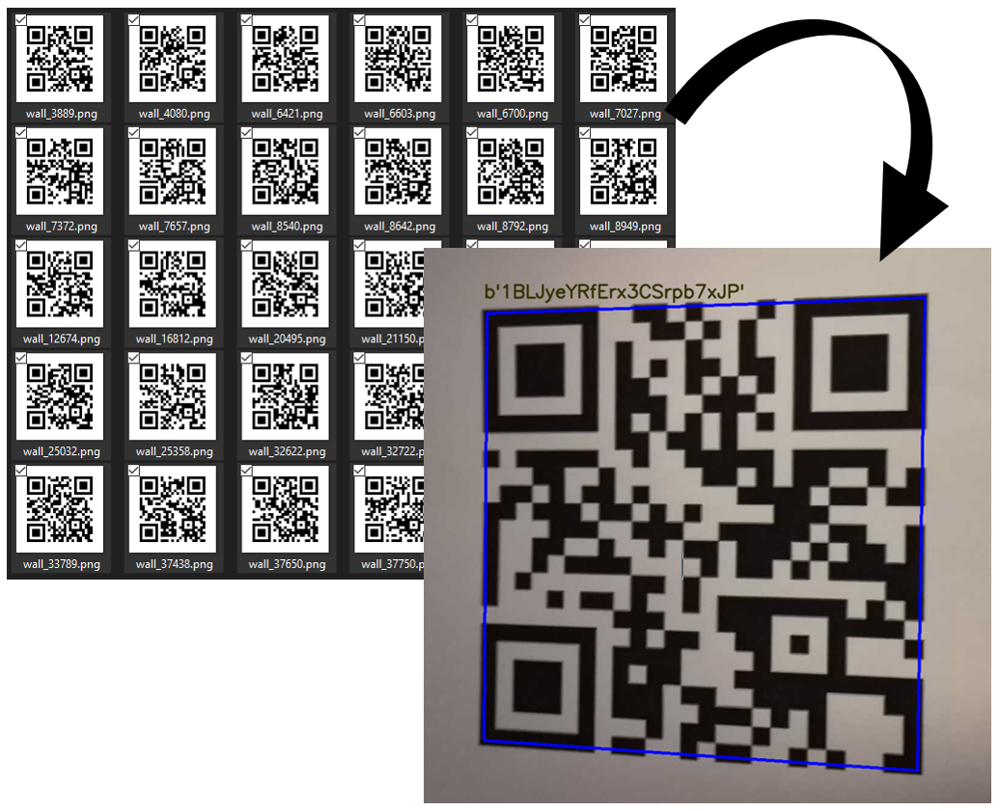

# QR-OnWall

this Code uses each of the follwing packages:
- [Ifcopenshell](https://github.com/IfcOpenShell/IfcOpenShell)
- [python-qrcode](https://github.com/lincolnloop/python-qrcode)

## Introduction
This code was a part of my Design Driven Project at the construction robotic master program at the RWTH Aachen university. 


## Project Description
The IFC file format can be used to describe building and construction data. The format is commonly used for Building Information Modelling.

A Quick Response code is a two-dimensional pictographic code used for its fast readability and comparatively large storage capacity. The code consists of black modules arranged in a square pattern on a white background. The information encoded can be made up of any kind of data (e.g., binary, alphanumeric, or Kanji symbols)

This code searchs in the IFC file on walls and gives every wall a QR-code with the Global ID of each wall.
## How to Use the Project
1. import the requested packages

    ```python
    import ifcopenshell
    import qrcode
    ```
2. open the ifc file and find the walls in it
   ```python
   ifc_path = '.\BIM_Building_Model.ifc'

   m = ifcopenshell.open(ifc_path)
   walls = m.by_type('IfcWall')
   ```
3. generate for each wall a qr-code
    ```python 
    Wall_guid = []  
    for wall in walls:
        Wall_info = wall.get_info()
        Wall_id =  Wall_info['id']
        data = Wall_info['GlobalId']
        Wall_guid.append(data)
        filename = (f"wall_{Wall_id}.png")
        img = qrcode.make(data)
        img.save(filename)
    ```



## Credits
credits go to mr `Thomas Krijnen` the developer of the [Ifcopenshell](https://github.com/IfcOpenShell/IfcOpenShell) library

also to mr `Lincoln Loop`the developer of the 
[python-qrcode](https://github.com/lincolnloop/python-qrcode) library

## License
Licensed unter the [MIT License](LICENSE)